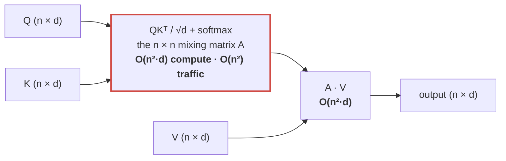
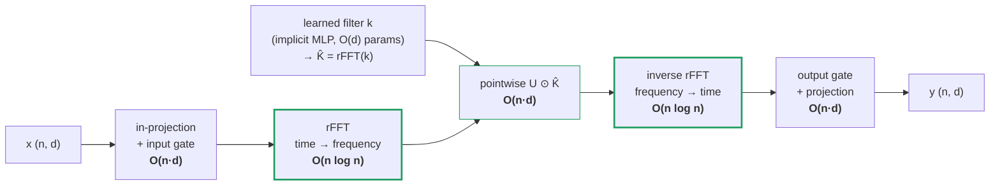
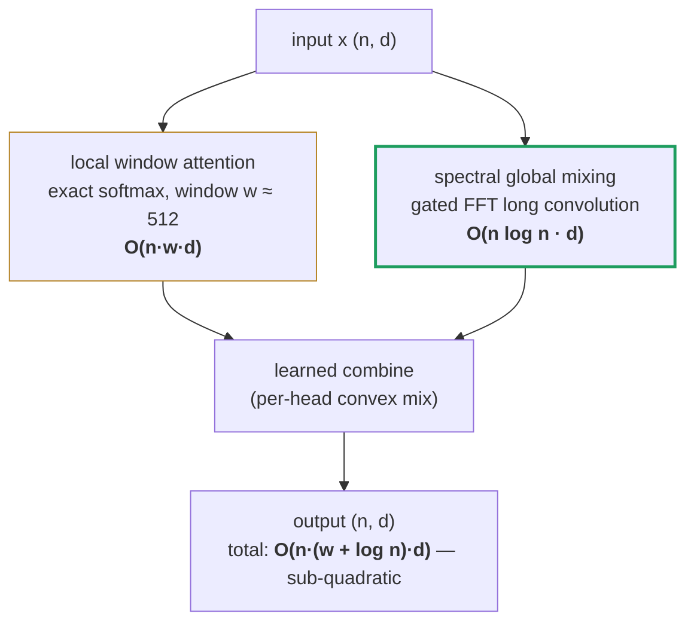
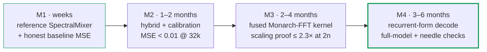

# Spectral Token Mixing: Frequency-Domain Speed Optimization for Long-Context LLMs

**Attention is the speed limit of large language models — its O(n²) mixing
step owns up to ~95% of long-context compute. This paper shows how to lift
that limit: transform to frequency space, mix in O(n), transform back — why
sub-quadratic attention is mathematically possible, how to build it, and what
an up-to-18× inference speedup is worth in the real world.**

Whitepaper · July 2026

---

## Abstract

Self-attention costs O(n²) because it *explicitly computes* all n² pairwise
token interactions. That cost is not a law of nature — it is the price of
representing the mixing operator as a dense, unstructured matrix. If the same
(or a close-enough) mixing can be expressed as an operator that is
**structured in some basis** — diagonal in the frequency basis, low-rank in a
sketched basis, banded in the time basis — then it can be *applied* without
ever being *materialized*, at O(n log n) or O(n·r) cost.

The frequency route is the oldest and most robust of these escapes: by the
**convolution theorem**, any mixing that depends on *relative position* (a
convolution) becomes **pointwise multiplication** after a Fourier transform —
n² multiply-adds collapse to n, plus two FFTs at n log n. Converting from time
space to frequency space and back is not overhead; it *is* the algorithm.

This paper develops the idea end-to-end: the mathematics of why it works, a
staged implementation path from a PyTorch reference operator to fused
tensor-core kernels, the validation gates it must pass, and a quantified
estimate of impact — at 1M-token context, **~95% of prefill compute is the
quadratic mixing term, and the spectral route cuts that term by ~20,000×, an
~18× reduction of total prefill FLOPs**.

We are equally explicit about the boundary: under standard complexity
assumptions, *exact* softmax attention admits no sub-quadratic algorithm in
the worst case. Everything below the wall is structure plus bounded,
measurable approximation.

---

## 1. Where O(n²) actually comes from

One attention layer computes, per head:

```
Attention(Q, K, V) = softmax(Q Kᵀ / √d) · V
                      └────┬────┘
                    the n × n mixing matrix A
```

**Figure 1 — the bottleneck is one object.**



Everything expensive lives in the mixing matrix `A` — row i says how much
token i listens to every other token. Computing `Q·Kᵀ` costs 2n²d FLOPs,
applying `A·V` costs another 2n²d, and at long context the n² memory traffic
(even when tiled by FlashAttention) dominates latency while the KV cache
dominates VRAM.

The crucial observation: **the model never needs the matrix — it needs the
matrix's *action* on V.** The n² cost is an artifact of choosing the most
general possible representation (every entry independent). Any structure in
`A` is an opportunity to apply it more cheaply. Note that the input and
output of the layer are both (n × d): the quadratic object exists only in the
middle, which is exactly what makes a drop-in replacement possible.

## 2. Why sub-quadratic is possible at all

### 2.1 The change-of-basis principle

A dense matrix that looks unstructured in one basis can be trivial in
another. Every known escape below O(n²) is an instance of one principle:

> **Find a basis where the mixing operator is (approximately) structured;
> transform in, apply the cheap structured form, transform out.**

| structure of A | basis where it is cheap | apply cost | lineage |
|---|---|---|---|
| Low-rank: `A ≈ U·Wᵀ` | any rank-r sketch | O(n·d·r) | linear attention, Performer |
| **Convolutional / Toeplitz**: `A[i,j] = f(i−j)` | **Fourier (frequency) basis** | **O(n log n)** | FNet, H3, Hyena, SSMs — **this paper** |
| Banded / local + few globals | time basis (sparsity) | O(n·w) | sliding-window, Longformer-class |

Real attention matrices in trained LLMs are empirically *dominated* by
exactly these components: strong local bands (syntax), smooth
position-relative decay (recency), plus a thin data-dependent residual
(retrieval heads). That decomposition is what the hybrid design in §4.2
exploits.

### 2.2 The convolution theorem — the engine of the frequency route

For sequences, the theorem states that convolution in time space is
pointwise multiplication in frequency space:

**Figure 2 — the collapse.**

```
  TIME SPACE                                        cost
  ──────────                                        ────
  y[i] = Σⱼ k[i−j] · v[j]                           n² multiply-adds
              │
              │  FFT                                n log n
              ▼
  FREQUENCY SPACE
  ───────────────
  Y[f] = K̂[f] · V̂[f]        (pointwise)            n multiplies
              │
              │  inverse FFT                        n log n
              ▼
  same y, computed exactly — total O(n log n)
```

The Fourier transform **diagonalizes every convolution**: a circulant
(position-relative) mixing matrix becomes a diagonal matrix `diag(F(k))` in
frequency space. What cost n² multiply-adds in the time basis costs n in the
frequency basis; the round-trip FFT costs O(n log n). The frequency↔time
conversion is the change of basis in which the quadratic object collapses.

Two classical facts make this exact rather than approximate *for
convolutional mixing*:

- **Causality** (a token may not attend forward) is handled by zero-padding
  to length 2n and truncating — linear convolution via circular FFT, exact.
- The FFT is **numerically orthogonal**: it preserves norms (Parseval), so
  the transform itself adds no instability; precision care is needed only in
  the pointwise stage (§4.3).

### 2.3 The honest boundary — what theory forbids

Two results frame every claim in this paper:

- **Exact attention is quadratic in the worst case.** Under the Strong
  Exponential Time Hypothesis, no algorithm computes softmax attention
  exactly in sub-quadratic time for arbitrary inputs (Keles, Wijewardena &
  Hegde, 2022).
- **Approximation is possible precisely when entries are bounded.** Alman &
  Song (2023) show near-linear-time attention *approximation* exists when
  query/key magnitudes are bounded — and cannot exist when they are not.

So "under O(n²)" is never free equivalence. It is **structure + bounded
error**, and the error must be measured against the exact operator on the
same inputs — never assumed.

## 3. The idea in detail: spectral token mixing

### 3.1 Core operator

Replace (or complement) the data-dependent mixing `softmax(QKᵀ)·V` with a
**long convolution applied in frequency space**, made data-dependent by cheap
elementwise gates (the H3/Hyena recipe):

**Figure 3 — the spectral mixing pipeline.**



- `k` is a **learned length-n filter per channel** — parameterized implicitly
  (a tiny MLP mapping position → filter value) so parameters stay O(d), not
  O(n·d), and the filter can be evaluated at any sequence length.
- The **gates** restore the input-dependence that a pure convolution lacks;
  stacking two or three gated convolution stages gives the operator a
  data-controlled, attention-like expressivity (H3 shows a 2-stage version
  already performs associative recall).
- Multi-head structure survives: independent filters per channel group.

Total: **O(n log n · d)** compute, **O(n·d)** memory, no n×n object anywhere.

### 3.2 What is kept, what is approximated

Kept exactly: position-relative mixing of *any* shape and range (the filter
is length n — a global receptive field from layer one), causality, norm
stability, streaming-friendly linearity.

Approximated: **content-based addressing** — "attend to the token that
*says* X, wherever it is." A convolution cannot do this alone; the gates
recover much of it; the remainder is the residual that the hybrid (§4.2) and
calibration (§4.2) exist to close. This is the honest reason FNet (pure
Fourier mixing, no gates) reaches only ~92–97% of BERT quality, while gated
long-convolution designs (Hyena) match Transformer perplexity at scale.

## 4. Implementation — the process in detail

### 4.1 Stage 1 — the reference operator (PyTorch, weeks)

A complete, runnable spectral mixer is ~30 lines:

```python
class SpectralMixer(nn.Module):                    # x: (batch, n, d)
    def __init__(self, d, filter_mlp_width=64):
        super().__init__()
        self.in_proj  = nn.Linear(d, 2 * d)        # value + gate
        self.out_proj = nn.Linear(d, d)
        self.filter   = ImplicitFilter(d, filter_mlp_width)  # pos -> k[pos]

    def forward(self, x):
        n = x.shape[1]
        v, g = self.in_proj(x).chunk(2, dim=-1)
        u  = v * torch.sigmoid(g)                  # gated input
        k  = self.filter(n)                        # (n, d) learned filter
        U  = torch.fft.rfft(u, n=2 * n, dim=1)     # zero-pad → causal conv
        Kf = torch.fft.rfft(k, n=2 * n, dim=0)
        y  = torch.fft.irfft(U * Kf, n=2 * n, dim=1)[:, :n]
        return self.out_proj(y * torch.sigmoid(g)) # output gate
```

Fix the evaluation shapes once (e.g. d_model 4096, 32 heads, sequence
lengths 8k / 32k / 128k, seeded random Q/K/V from a reference model), then
measure four things against the exact attention output **on identical
inputs**: MSE, wall-clock latency, peak VRAM, and the scaling curve.
Raw spectral mixing will *not* match exact attention zero-shot — record that
honestly; it is the baseline the next stage improves on.

### 4.2 Stage 2 — hybrid + calibration (1–2 months)

Two moves close most of the accuracy gap:

**Figure 4 — the hybrid operator.**



1. **Hybrid**: exact sliding-window attention handles the local band — where
   most of the mixing mass and most of the MSE lives — while the spectral
   path carries the global, long-range component. Window cost O(n·w) with
   w≈512 stays sub-quadratic.
2. **Calibration / distillation**: fit the filters, gates, and combine
   weights to *reproduce the exact layer's outputs* on sampled inputs — the
   teacher is `softmax(QKᵀ)V` itself, so no labeled data is needed. LoLCATs
   (2024) demonstrates that linearizing a full Llama-scale model this way
   recovers quality while training <0.2% of parameters (LoRA-sized patches).

### 4.3 Stage 3 — kernels and the decode path (2–6 months)

What turns a passing prototype into production speed:

- **Fused FFT-conv kernel**: one CUDA/Triton kernel doing
  pad → rFFT → pointwise ⊙ → irFFT → gate without touching HBM in between.
  The state of the art is a **Monarch decomposition of the FFT**
  (FlashFFTConv, 2023): the FFT is rewritten as chained small dense matmuls
  that run on **tensor cores** — the same silicon that makes attention fast —
  yielding up to ~8× over stock FFT convolution and long-context wall-clock
  wins over FlashAttention-2.
- **Precision plan**: fp16/bf16 storage; butterfly/Monarch stages accumulate
  in fp32. FFT roundoff grows only O(√log n) — benign — but the pointwise
  stage on a 2n-length spectrum needs fp32 accumulation to hold tight MSE at
  128k and beyond.
- **Decode path** (the honest hard part): FFT convolution is a *prefill*
  operator; naively re-running it per generated token would cost O(n log n)
  per token — worse than the KV cache it replaces. The production answers,
  in order of maturity: (a) chunked/blocked FFT decode with cached spectra;
  (b) distilling the fitted filters into a **state-space (recurrent) form**
  with O(1) per-token state — exact for the filter class the implicit
  parameterization produces. This is a required deliverable, not an
  afterthought.

### 4.4 Validation protocol

A claim only counts when it survives all four gates, measured on pinned
hardware against the exact operator on identical inputs:

| gate | test | pass condition |
|---|---|---|
| Accuracy | MSE vs exact attention output | below the target budget (e.g. <0.01 at 32k, tightening with scale) |
| Cost dominance | latency + peak VRAM vs exact | both strictly lower |
| Scaling proof | run at n and 2n | latency ratio ≈ 2.1–2.3×, not 4× |
| Compounding | full-model spot check: a fact planted deep in a long sequence must be retrieved through all layers | retrieval holds; per-layer error does not amplify |

The scaling proof is what certifies "sub-quadratic" as a *measured* property
rather than a claim; the compounding check is what protects against a
per-layer error that looks small but destroys the model over 32–80 layers.

## 5. The accounting — verified numbers

FLOP model for a 70B-class transformer (d_model 8192, 80 layers; linear
parts ≈ 29·d² FLOPs/token/layer covering QKVO projections + SwiGLU FFN;
quadratic mixing = 4n²·d per layer; spectral mixing costed generously at
10·n·log₂n·d per layer):

**Figure 5 — where prefill compute goes, and what the spectral route does.**

```
 prefill FLOPs by component        ██ quadratic mixing   ░░ linear (FFN + projections)

    8k   │███░░░░░░░░░░░░░░░░░░░░░│   mixing 12%    spectral speedup:  1.1×
  128k   │█████████████████░░░░░░░│   mixing 69%    spectral speedup:  3.2×
    1M   │███████████████████████░│   mixing 95%    spectral speedup: 18.6×
         0%                     100%

 total prefill speedup vs context length (log scale)
  20× ┤                                            ● 18.6×
  10× ┤
   5× ┤
   3× ┤                       ● 3.2×
   1× ┼───● 1.1×
      └───┬───────────────────┬────────────────────┬────
         8k                 128k                  1M
```

| context n | mixing share of prefill (exact) | spectral cut of the mixing term | **total prefill speedup** |
|---:|---:|---:|---:|
| 8k | 12% | 252× | 1.1× |
| 128k | **69%** | 3,084× | **3.2×** |
| 1M | **95%** | 20,972× | **18.6×** |

Reading: below ~16k the FFN dominates and the spectral route is nearly
irrelevant — *this is why short-context benchmarks under-sell it*. The
quadratic term crosses 50% of compute around n ≈ 60k and owns the budget from
there. The impact is a **long-context phenomenon**, which is exactly where
the economic pain is.

Memory: no n×n object at any point; activation memory O(n·d). At decode, the
distilled recurrent form replaces the KV cache — ~43 GB at 128k context
(fp16, 8× GQA, on the model above) — with a **constant-size state**.

## 6. Real-world impact

**In GPU economics.** Prefill cost at 128k context drops ~3×; at 1M, ~18×.
For an inference provider whose long-context traffic is prefill-dominated
(document analysis, code-repository ingestion, agent memory replay), that is
the difference between serving a 1M-token request in minutes versus tens of
seconds on the same silicon — or serving it at all: at today's frontier
pricing a single 1M-token prompt costs dollars; an 18× compute cut moves it
toward dimes. The KV-cache elimination compounds this at decode: constant
state means long conversations stop evicting batch slots, which raises
tokens/sec/GPU — the metric that *is* the business.

**In what becomes possible.** Capabilities that today are simulated with
retrieval and chunking become native: whole-codebase reasoning, full-day
agent sessions with unbroken memory, entire legal/medical corpora in one
window, hour-scale audio and video streams. Every one of these is currently
gated not by model quality but by the quadratic bill.

**On the edge.** Constant decode state is the enabler for *local* long-memory
agents on consumer and embedded GPUs, where a 43 GB KV cache simply does not
fit. A sub-quadratic mixer is the difference between edge devices running
short-context toys and running genuine assistants.

**In energy.** Prefill FLOPs are watts. An 18× cut at million-token scale is
not an optimization; it is the difference between long-context AI being an
energy story regulators notice and one they don't.

**Impact honesty box.** The numbers above are ceilings conditional on the
gates in §4.4: they assume the hybrid, calibrated operator passes its MSE
budget at target context, that the recurrent distillation holds decode
quality (needle-in-a-haystack retrieval is the known weak spot of
convolutional mixers — it must be in the test suite), and that the fused
kernel realizes its FLOP advantage in wall-clock (memory-bound regimes can
eat asymptotic wins; the scaling proof exists to catch this). A failed gate
is a recorded failure, not a footnote.

## 7. Milestones



| # | deliverable | gate |
|---|---|---|
| M1 | Reference operator + fixed-shape eval harness | honest baseline MSE published (expected: fails the budget) |
| M2 | Hybrid (local-exact + spectral-global), calibrated | MSE < 0.01 at ≤32k; latency and VRAM strictly below exact |
| M3 | Fused tensor-core FFT kernel | 2× length → ≤2.3× latency, measured |
| M4 | Recurrent-form distillation, streaming decode | full-model spot check + needle retrieval pass |

## 8. References

- Lee-Thorp, Ainslie, Eckstein, Ontañón — *FNet: Mixing Tokens with Fourier
  Transforms* (2021)
- Gu, Goel, Ré — *Efficiently Modeling Long Sequences with Structured State
  Spaces (S4)* (2021)
- Fu, Dao, et al. — *Hungry Hungry Hippos: Towards Language Modeling with
  State Space Models (H3)* (2022)
- Poli, Massaroli, et al. — *Hyena Hierarchy: Towards Larger Convolutional
  Language Models* (2023)
- Fu, et al. — *FlashFFTConv: Efficient Convolutions for Long Sequences with
  Tensor Cores* (2023)
- Gu, Dao — *Mamba: Linear-Time Sequence Modeling with Selective State
  Spaces* (2023)
- Keles, Wijewardena, Hegde — *On the Computational Complexity of
  Self-Attention* (2022)
- Alman, Song — *Fast Attention Requires Bounded Entries* (2023)
- Choromanski, et al. — *Rethinking Attention with Performers* (2020)
- Zhang, et al. — *LoLCATs: On Low-Rank Linearizing of Large Language
  Models* (2024)

---

*Working draft. The figures in §5–6 are analytic estimates from the stated
FLOP model; they become claims only when reproduced as hardware measurements
under the validation protocol of §4.4.*
